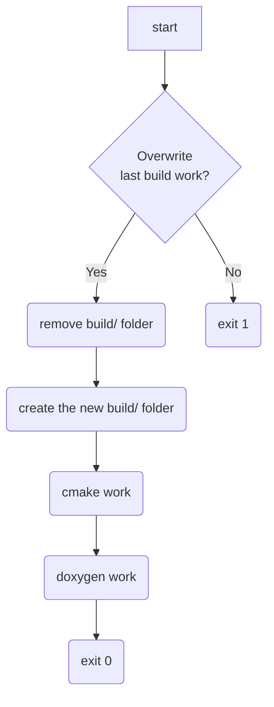

# CMAKE C PROJECT

author : Terry Yu


[TOC]


## Storage Layout

```txt
.
├── cmake/				// stores cmake script (install and test feature)
│   ├── install.cmake
│   └── test.cmake
├── doc/				// stores doxygen documentation
│   └── doxygen
│       └── Doxyfile
├── src/				// stores implementation (add.c) and interface(add.h).
│   ├── add.c
│   ├── add.h
│   └── CMakeLists.txt
├── test/				// stores unit test implementation (test_add.c)
│   ├── CMakeLists.txt
│   └── test_add.c
├── auto_build.sh		// bash script for building work.
├── CMakeLists.txt		// the root of CMake script.
└── readme.md			// project description file.

5 directories, 11 files
```


## Building Work ( Bash Script )

### flow chart



### content

```bash
#!/bin/bash

# check if build folder exist
if [[ -d build ]]; then
    echo "build/ folder already exist"
    printf "%s " "overwrite? (yes/no) "
    read ans
    if [[ ${ans} == "yes" ]]; then
        rm build/ -rf
    else 
        exit 0
    fi
fi

# create build folder
mkdir build

# record current work path
origin_pwd=$(pwd)

# go to build folder
cd build

# cmake 
cmake .. \
-D CMAKE_INSTALL_PREFIX=$(pwd)/install \
-D CMAKE_BUILD_TYPE=Release

make 

make install

ctest

# doxygen
cd ${origin_pwd}/doc/doxygen
doxygen Doxyfile
```


### usage

All you need to do is run the above bash script

```bash
bash auto_build.sh
```

